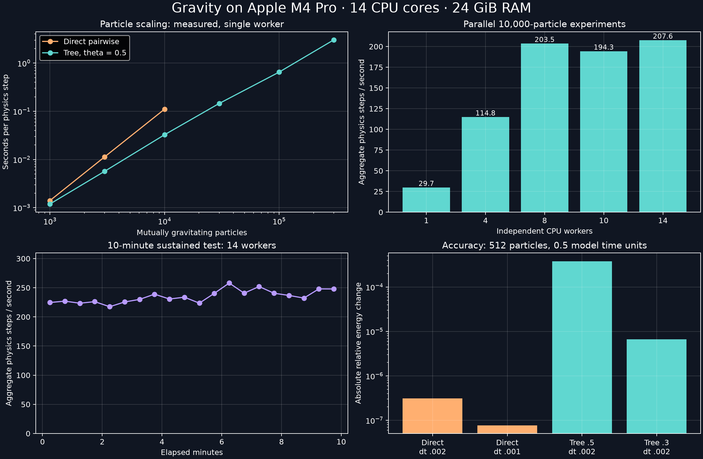
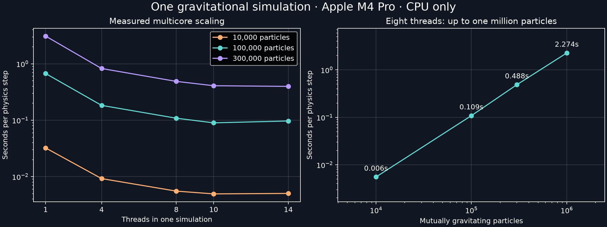

# Gravity benchmark — Apple M4 Pro

Measured 2026-09-15 19:26:47 -0400. CPU-only REBOUND 5.1.1, Python 3.14.3, NumPy 2.5.3. Hardware: 10 performance + 4 efficiency cores, 24 GiB RAM. Connected to AC power. Other applications remained running; initial load averages: [76.79736328125, 25.5654296875, 11.8564453125].

## Findings

- This machine can compute 300,000 mutually gravitating particles with the tree solver; this is an actual measured workload, not a particle-count extrapolation.
- The initial binary uses approximately one CPU core per simulation. Multiple processes use the CPU across independent experiments. The supplemental OpenMP build below additionally measures multicore acceleration within one simulation.
- Best short parallel result: 14 workers. The ten-minute run achieved **234.86 aggregate steps/s**, using **11.83 CPU cores on average**.
- At that sustained rate, eight hours would yield about **676 jobs of 10,000 steps each**, for the identical 10,000-particle workload. This is a throughput projection, not a completed overnight run or validated merger duration.



## Particle scaling

Median of three timed batches after one warm-up step; setup and state copying excluded. Every particle contributes gravity. Peak memory includes the Python process, initial arrays and temporary simulation copies; it is not an isolated particle-buffer size. Large cases use only one step per timed batch, so their long-run performance remains unverified.

| Particles | Solver | ms / step | Steps / sec | Projected 10,000 steps | Peak process MiB |
|---:|---|---:|---:|---:|---:|
| 1,000 | basic | 1.40 | 712.84 | 14.0 sec | 44.2 |
| 3,000 | basic | 11.32 | 88.37 | 1.9 min | 45.7 |
| 10,000 | basic | 110.41 | 9.06 | 18.4 min | 49.6 |
| 1,000 | tree | 1.19 | 839.51 | 11.9 sec | 44.5 |
| 3,000 | tree | 5.68 | 175.98 | 56.8 sec | 46.2 |
| 10,000 | tree | 32.56 | 30.71 | 5.4 min | 52.2 |
| 30,000 | tree | 145.23 | 6.89 | 24.2 min | 67.6 |
| 100,000 | tree | 649.21 | 1.54 | 1.80 hr | 114.7 |
| 300,000 | tree | 3030.28 | 0.33 | 8.42 hr | 236.1 |

The 10,000-step column multiplies measured median time by 10,000. Density changes, close encounters, accuracy settings and output can change the cost. No render or snapshot-writing cost is included.

## Parallel experiments

Independent 10,000-particle tree simulations, 15 seconds per worker-count trial. Workers are started before a shared deadline. Throughput includes copying the state and evolving an eight-step segment repeatedly. This keeps the density and computational workload comparable throughout the test. It tests sustained execution of repeated segments, not the physical evolution of one system for ten minutes.

| Workers | Aggregate steps/s | Speedup vs 1 | CPU cores used |
|---:|---:|---:|---:|
| 1 | 29.74 | 1.00x | 0.98 |
| 4 | 114.79 | 3.86x | 3.95 |
| 8 | 203.52 | 6.84x | 7.85 |
| 10 | 194.33 | 6.54x | 8.92 |
| 14 | 207.59 | 6.98x | 10.88 |

## Ten-minute sustained test

- Workers: 14.
- Total completed steps across workers: 140,992.
- Aggregate rate: 234.86 steps/s.
- First two minutes: 225.32 steps/s; final two minutes: 241.26 steps/s (+7.1%). Rates use overlap-weighted 30-second bins.
- Peak sampled sum of child-process RSS: 521.4 MiB. Summed RSS can double-count shared pages.
- Minimum sampled available system RAM: 3.89 GiB.
- macOS thermal-status output is saved in resource_samples.jsonl. It does not provide CPU temperatures or prove the absence of throttling. Throughput is the primary sustained-performance evidence.

## Accuracy checks

1. Two-body circular orbit, IAS15, 100 orbital periods: relative energy change **1.33e-15**. This checks the separate high-accuracy planetary solver, not tree accuracy.
2. Tree versus direct gravity on the same 512-particle initial state, measured from a small velocity kick: median relative discrepancy **0.584%**, 95th percentile **1.919%**, maximum **5.939%** at theta=0.5.
3. Evolve a 512-particle softened cloud for 0.5 model time units. Energy is calculated independently using the same softened pair potential. Halving the direct-solver timestep reduces energy error approximately fourfold, consistent with second-order leapfrog integration.
4. Tightening tree theta from 0.5 to 0.3 reduces energy drift and position discrepancy; the scaling table uses theta=0.5, not the more accurate setting.

| Solver | Theta | Timestep | Relative energy change | Position RMS vs direct half timestep |
|---|---:|---:|---:|---:|
| basic | 0.5 | 0.002 | 3.08901e-07 | 2.76651e-07 |
| basic | 0.5 | 0.001 | 7.72424e-08 | 0 |
| tree | 0.5 | 0.002 | 0.000382223 | 0.000314903 |
| tree | 0.3 | 0.002 | 6.64962e-06 | 4.63744e-05 |

## What to build with this

- **Interactive exploration:** start with 3,000–10,000 gravitating particles and decouple rendered frames from physics steps. Actual UI frame rate has not been benchmarked.
- **Offline galaxy experiments:** 30,000–100,000 particles are a practical initial design range based on these timings. Save snapshots for smooth playback.
- **Higher resolution:** 300,000 particles was tested successfully; budget hours for long runs. The supplemental tests below also measure one million particles with a separate threaded build.
- **Dense star clusters:** these timings use softened gravity. Close binary encounters and collisional cluster evolution need an appropriate solver and a separate benchmark; these results do not validate them.
- **Galaxies:** particles represent samples of stellar/dark-matter mass. A stable disk, halo, physical unit system and timestep-convergence tests are still required. The test cloud is not a realistic or equilibrium galaxy.

No physical duration in years is claimed: the benchmark uses G=1, total mass=1, radius=1, softening=0.02, timestep=0.00001 and a uniform spherical distribution with Gaussian velocities. A physical length and mass scale would define the time unit; a scientifically acceptable timestep must then be validated for the intended system.

## Reproduce

From the task directory:

```sh
work/venv/bin/python outputs/gravity_benchmark.py
work/venv/bin/python outputs/make_report.py
```

The first command overwrites benchmark_results.json and runs the complete suite, including the ten-minute sustained test. To use a fresh environment, create a Python virtual environment and install the versions in requirements.txt. The resource sampler used here is supplied separately as resource_monitor.py; it should run while the benchmark is active.

## References

- [REBOUND gravity solvers](https://rebound.hanno-rein.de/gravity/): direct summation and Barnes–Hut tree methods.
- [REBOUND documentation](https://rebound.hanno-rein.de/): integrators and scientific scope.

Raw measurements are in benchmark_results.json and resource_samples.jsonl. Source is in gravity_benchmark.py. Charts display measured values only.

## Supplemental: one simulation across multiple CPU cores

A second REBOUND 5.1.1 build enables OpenMP using Apple Clang and the existing Homebrew libomp runtime. It is isolated under work/openmp; the original serial environment is preserved. OMP_WAIT_POLICY=PASSIVE. Same seeded particles, softening, integrator and timestep as the original table. Three timed batches per case, after warm-up. Compilation explicitly selects the installed macOS 26.5 SDK to avoid a local linker incompatibility with SDK 27.0. Supplemental memory values are process high-water marks and can include an earlier, larger case within that same process. These are short scaling measurements after the sustained ensemble test, not a ten-minute threaded test.

| Particles | Threads | Theta | ms / step | Effective CPU cores | Peak process MiB |
|---:|---:|---:|---:|---:|---:|
| 10,000 | 1 | 0.5 | 32.31 | 1.00 | 52.0 |
| 100,000 | 1 | 0.5 | 673.48 | 1.00 | 120.1 |
| 300,000 | 1 | 0.5 | 3103.55 | 0.98 | 227.0 |
| 10,000 | 4 | 0.5 | 9.23 | 3.47 | 52.8 |
| 100,000 | 4 | 0.5 | 183.22 | 3.58 | 119.5 |
| 300,000 | 4 | 0.5 | 825.09 | 3.54 | 245.7 |
| 10,000 | 8 | 0.5 | 5.54 | 6.04 | 51.2 |
| 100,000 | 8 | 0.5 | 108.57 | 6.13 | 119.4 |
| 300,000 | 8 | 0.5 | 487.91 | 6.01 | 272.0 |
| 1,000,000 | 8 | 0.5 | 2274.16 | 6.07 | 678.9 |
| 100,000 | 8 | 0.3 | 343.74 | 7.03 | 678.9 |
| 10,000 | 10 | 0.5 | 4.95 | 7.10 | 51.0 |
| 100,000 | 10 | 0.5 | 89.82 | 7.62 | 119.5 |
| 300,000 | 10 | 0.5 | 408.92 | 7.45 | 272.0 |
| 10,000 | 14 | 0.5 | 5.04 | 8.37 | 53.2 |
| 100,000 | 14 | 0.5 | 96.94 | 8.58 | 120.4 |
| 300,000 | 14 | 0.5 | 397.74 | 8.84 | 273.1 |

One million mutually gravitating particles was actually tested: **2.274 seconds per step** with eight threads. Multiplying that short measurement by 10,000 gives **6.32 hours**; this is a projection, not an evolved galaxy or a completed long run. Best measured 100,000-particle thread count: **10**, at **89.8 ms/step**.

The eight-thread accuracy checks are saved in openmp_8.json and checked against the original force-error result. More threads need not be faster: shared-memory overhead, serial tree construction, core speeds and other workloads all affect scaling.


