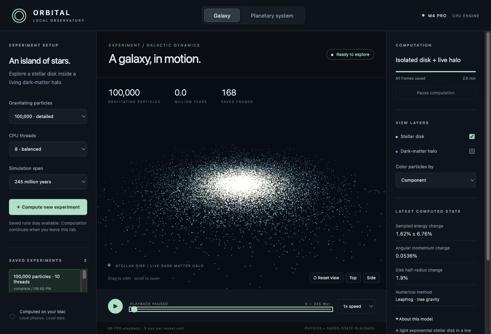
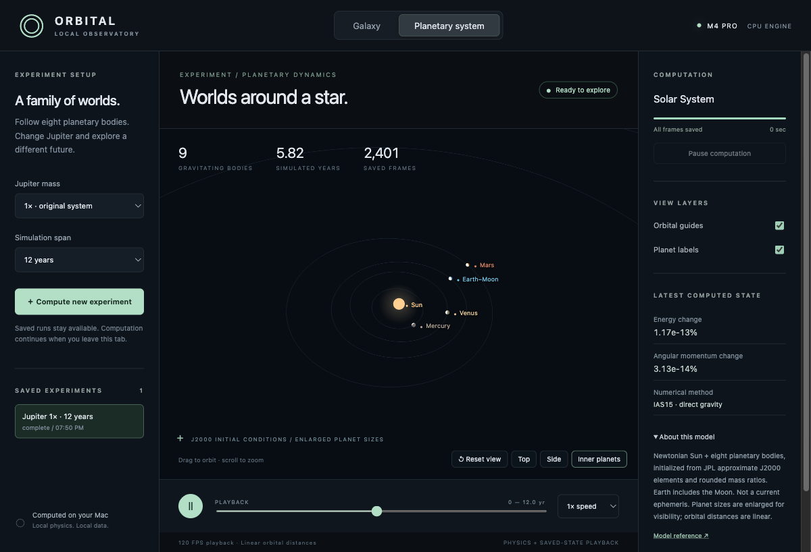

# Orbital — local CPU observatory

Open **http://127.0.0.1:8766** (Observe) or **http://127.0.0.1:8766/lab** (Compute) while the server is running.

## What is built

- **Two pages.** *Observe* (`/`) is the Three.js 3D viewer for saved and running frames. *Compute* (`/lab`) is the control room: every initial-condition slider, a health strip, live ETA from the last chunk, queue, SVG history charts, diagnostics, and confirmed **Remove**. Compute loads no Three.js and never downloads frames, so that tab stays far below 300 MB (measured JS heap 5 MB after a 30 s slider/polling soak).
- **Galaxy (model revision 5):** 1–5 live N-body galaxies on one leapfrog tree. Galaxy A keeps the full structure/lifecycle/ISM knobs; galaxies 2–5 are compact clones (mass, size, placement, velocity, spin). Isolated `n_galaxies=1` still bit-matches the revision-3 disk+halo (same DF; generator stamped 5). Default new Compute job is **2 galaxies**. Optional central black hole, stellar lifecycle, and a laboratory two-phase ISM (grid pressure, ram drag, CIE-like cooling, blastwave-delayed SN heat). All particles contribute gravity. 10,000–1,000,000 particles shared across the live galaxies; 1–14 CPU threads; span limited by a 120-hour compute cap. This is not a calibrated MW–M31 run, not SPH, and not a prescribed merger movie.
- **Planetary system:** the Sun and eight planetary bodies, using JPL approximate J2000 orbital elements, rounded mass ratios and a direct Newtonian integrator. Jupiter at 1×, 3× or 10×, per-planet mass scales 0.25–10×, and an optional perturber body.
- Rotate, zoom, top/side views, inner-planet view, color/stage/galaxy/layer controls, particle inspector, timeline scrubbing, playback speed, and independent computation pause/resume.
- Locally saved frames and recoverable checkpoints (including lifecycle arrays). A LaunchAgent can keep the HTTP server alive overnight; `caffeinate` wraps the worker while it integrates. Closing the lid still sleeps a typical MacBook. Nothing is sent to a cloud service. The HTTP listener binds only to 127.0.0.1.




## Start again

From any directory:

```sh
start-openorbital
```

That is a two-line wrapper around `outputs/observatory/start.sh`. Equivalents: `Start OpenOrbital` in zsh, or double-click `Start Open Orbital.command`. If http://127.0.0.1:8766/api/jobs already answers, it only opens the Compute dashboard and the terminal may close. If not, it writes and loads the LaunchAgent `com.openorbital.observatory` (KeepAlive for the HTTP server only), waits until ready, opens `/lab`, and exits. The agent runs a trampoline in `~/Library/Application Support/Open Orbital` so macOS will not block launchd from a Desktop/Documents/Downloads checkout. If the agent still does not answer, `start.sh` unloads it and starts `run.sh` from the current session. `stop-openorbital` unloads the agent and SIGTERMs a leftover :8766 observatory listener; workers checkpoint.

Foreground fallback (no `launchctl`): `sh outputs/observatory/start.sh` prints that the window must stay open and `exec`s `run.sh`. To start the Python listener only:

```sh
sh outputs/observatory/run.sh
```

Install or stop the daemon without opening a browser:

```sh
sh outputs/observatory/install-daemon.sh      # write plist and load
sh outputs/observatory/install-daemon.sh --write-only
sh outputs/observatory/stop-daemon.sh
```

Do not bootstrap the LaunchAgent against port 8766 while a science job is already integrating under a different server process.

This uses the isolated Python runtime at `work/venv` and the previously built multicore REBOUND library at `work/openmp`. The app has no npm server or external CDN dependency; Three.js is bundled locally with its license. Workers are wrapped in `caffeinate -dims` while they integrate; idle sleep may return when no worker is alive. Closing the lid still sleeps a typical MacBook. Interrupted jobs with `control.json` still set to `run` auto-resume on server start (not paused, not `wall_capped`). A paused job stays paused.

Saved experiments live under `work/observatory-data`, separate from the source. Set `OBSERVATORY_DATA` to an absolute directory before launching to choose another location. Each run contains its configuration (including free-text notes), metadata, binary frames, optional `diagnostics.jsonl` and `galaxy_index.bin`, checkpoint pairs, status, and log. New runs also archive `physics.py`, `stellar.py` and `ism.py`. The application retains up to twenty-four runs and checks for free disk space. A 25th Start is rejected until one run is removed (Compute disables Start at 24/24). Runs are removed only through the Compute page's confirmed **Remove** (or `DELETE /api/jobs/:id`); the four original comparison ids (`0e45a855ba11`, `44c528079f88`, `ff56d195ce89`, `58ab7c268cdd`) stay protected if those folders exist.

## Arrange experiments in a queue

On **Compute**, configure an experiment and click **Add to queue**. Repeat for each galaxy or planetary experiment, use **Move up / Move down** to arrange waiting runs, then click **Start queue**. The server runs them one at a time, even after the browser tab closes. A LaunchAgent can keep the HTTP server alive; closing the lid still sleeps the Mac.

**Hold queue** lets the current run finish but prevents the next from starting. **Stop computation** pauses the selected run; pausing the queue's current run blocks the batch until resumed or removed. Older unrelated paused experiments do not block a new batch. If a manual experiment is already computing when the queue starts, the queue waits for it and treats it as its current run. Failed workers hold the queue; review the failure, then Start queue to continue past it. After a daemon restart, queue `enabled` is preserved; an interrupted current job with `control=run` auto-resumes. Paused jobs stay paused.

Waiting runs can be removed using the existing confirmation dialog. Queued and completed experiments together count toward the 24-run limit. Disk checks include all waiting jobs and are repeated before launch. Adding to an enabled queue appends work to the active batch. Settings are saved when added; changing sliders afterwards does not edit a waiting run.

Agent map: server.py owns the scheduler, under the same lock as API mutations. `work/observatory-data/queue.json` atomically stores `enabled`, ordered `ids`, `current`, and a status message. A queued job has config/status but no worker or frames yet. `/api/queue` GET reads state; POST accepts `start`, `hold`, `up`, `down` (moves include `id`). `/api/queue/jobs` POST validates and adds a new experiment. Only one server may own a data directory. Physics and frame formats are unchanged.

Validation: `PYTHONPATH="$PWD/work/openmp" work/venv/bin/python outputs/observatory/tests/validate_queue.py` runs real small workers with temporary data on port 8767. Existing API tests can save a separate report using `OBSERVATORY_TEST_REPORT` to preserve historical evidence.

## Stellar lifecycle and ISM — what they are and are not

Types stored per particle: cold gas, protostar, main sequence, giant, white dwarf, neutron star, black hole, halo, central black hole, hot/ionized gas. Birth converts eligible gas parcels at rate eligible mass / `t_sf`; each new star draws a Kroupa mass that sets its clock, while the parcel's gravitational mass is unchanged. Lifetime is `10 Gyr × (m/M☉)^-2.5` clipped to 3–20,000 Myr. At death the parcel keeps only the remnant fraction of its mass; the rest returns to neighbouring gas, so total mass is conserved (measured drift 0.0 at speed 40). `lifecycle_speed` multiplies the stellar clock: 1 = physical lifetimes (only massive stars die within 245 Myr); ~40 fits a solar lifetime into a 250 Myr run. Any speed other than 1 is a laboratory setting, not a calibration.

When **two-phase ISM** is on, gas parcels also carry specific internal energy `u` and metallicity `Z`. After every leapfrog step they feel a momentum-conserving grid pressure force, ram drag, CIE-like cooling Λ(T, Z) with a metal-line peak near 10^5.4 K (Field-style warm/hot attractors), and Stinson-like delayed cooling for ~15 Myr after a supernova dump. Star formation is allowed only in cold (T < 3.5×10^4 K), dense (n_H above `n_sf`), non-expanding gas. This is **not SPH**: there is no kernel, no Riemann solver, no resolved Jeans mass, and no chemistry. Superparticle SN coupling (`sn_feedback`) is a laboratory parameter because one slot is 10^4–10^6 suns, not 10^51 erg per resolved star. Energy change is not a numerical-error bound when the lifecycle or ISM is on. Turn the ISM off to recover the revision-4 collisionless bookkeeping.

## Completed test instance

| Run | Result |
|---|---|
| Galaxy, revision 2 | 100,000 particles: 30,000 stellar + 70,000 halo |
| Duration | 245 Myr; 500 integration steps; 168 saved frames |
| Active computation time | 157.84 seconds on 10 threads, including snapshot and diagnostic work |
| Disk half-radius change | +1.93% |
| Total angular-momentum change | 0.0536% |
| Solar System | 12 years; 2,401 frames; relative energy change 1.17e-15 |
| Modified Solar System | Jupiter at 3× mass; 12 years; completed through the browser UI |

The original revision-1 galaxy run remains available for comparison. It used a colder, less balanced disk and contracted by about 12%; the revision-2 model uses disk circular forces and approximate Jeans velocity support. Neither is a calibrated model of the Milky Way.

## Validation and limits

- `validation.json`: analytical two-body period check, 50-year planetary energy check, small-galaxy timestep/tree comparisons, and checkpoint continuation agreement.
- The 2,048-particle galaxy test had relative energy change 4.40e-5 over ten model time units; halving the timestep reduced it to 5.69e-6. These small-model results do not establish the same error at 100,000 particles.
- `api_validation.json`: real server restart and resumed integration; the first saved frame stayed identical, paused frames stopped growing, concurrent active jobs were rejected, and invalid frame requests were rejected.
- Browser checks covered both modes, a new modified planet run, pause/resume, timeline seeking, layers, camera controls and responsive layouts. No browser console errors were observed during these checks.
- Large-galaxy energy is a **Monte Carlo estimate**, with approximate sampling uncertainty displayed. It is not an integration-error bound. The measured 1.62% difference has approximately 6.76% sampling uncertainty.
- Galaxy units are G=1, mass=10^10 solar masses, length=3 kpc and time=24.50 Myr. The tree opening angle is 0.4, softening is 0.06 model lengths and timestep is 0.02 model time units. This is an exploratory model. The ISM is a particle-mesh laboratory, not SPH. There is no relativity or resolved binary-star encounters. Long-term equilibrium is not established by the short test. Birth-galaxy colors are frozen at t=0.
- Planet sizes are enlarged for visibility; orbital distances are linear. Orbital guides show the initial Keplerian elements. Playback interpolates saved positions; it does not replace the CPU physics.
- Benchmark timings for a uniform sphere do not directly predict this centrally concentrated disk/halo workload.
- **Revision 3 evidence** (`validation_r3.json`, `api_validation_r3.json`): revision-2 initial conditions reproduced exactly by the new defaults; lifecycle-off 2,048-particle bounds unchanged; lifecycle-on mass conservation to float precision with deterministic resume; a full-knob API run with 24-byte frames, server restart and checkpoint recovery. Historical files were not modified for later revisions.
- **Revision 4 evidence** (`validation_r4.json`, `api_validation_r4.json`): isolated `n_galaxies=1` bit-matches the revision-3 generator; two-galaxy head-on separation decreases; five-galaxy N split; retrograde spin flips L_z; encounter lifecycle keeps halo types fixed; API accepts 2 and 5 galaxies, rejects 6, recovers a 2-galaxy checkpoint with 24-byte frames. The 120-hour estimate scales from the single measured revision-2 point, ×1.05 when `n_galaxies>1` (prediction). A 1,000,000-particle isolated galaxy (lifecycle off, 8 threads) was measured at **5.67 s/step** over 20 leapfrog steps (`validation_1m.json`); that is a short live-tree run, not a 120 h proof.
- **Revision 5 evidence** (`validation_r5.json`, `api_validation_r5.json`): isolated collisionless ICs still bit-match revision 3; lifecycle-off energy bounds unchanged; ISM cooling curve has a metal-line peak; ram drag conserves gas momentum and reduces relative speed; hot gas is ineligible for star formation; an 80-step ISM+lifecycle run conserves mass; ISM checkpoint resume is bit-identical. Historical `validation.json` / r3 / r4 files were not modified.

## Source map

- `physics.py`: parameterized initial conditions, unit conventions, diagnostics.
- `stellar.py`: stellar lifecycle on live REBOUND masses; baryon checkpoints.
- `ism.py`: laboratory two-phase ISM (cooling, pressure, ram, blastwave heat) on the density grid.
- `worker.py`: integration, lifecycle and ISM substeps, versioned frames, controls, transactional checkpoints, 120 h cap.
- `server.py`: job management, validation schema, estimator, Remove rules and loopback HTTP API.
- `static/app.js`, `static/index.html`: Observe WebGL viewer and controls.
- `static/lab.html`, `static/lab.js`, `static/shared.js`: Compute page (no Three.js, no `/frames`; SVG history charts).
- `static/style.css`: both pages.
- `tests/validate_physics.py`, `tests/validate_api.py`, `tests/validate_queue.py`: numerical, recovery, and queue checks (write `*_r5.json` / `queue_validation.json`; never overwrite historical `validation.json` / `validation_r3.json` / `validation_r4.json`).

Run validation from the task root:

```sh
PYTHONPATH="$PWD/work/openmp" work/venv/bin/python outputs/observatory/tests/validate_physics.py
PYTHONPATH="$PWD/work/openmp" work/venv/bin/python outputs/observatory/tests/validate_api.py
```

The API test creates an isolated temporary run and uses port 8767.

## Model references

- [JPL approximate planetary elements](https://ssd.jpl.nasa.gov/planets/approx_pos.html)
- [JPL planetary physical parameters](https://ssd.jpl.nasa.gov/planets/phys_par.html)
- [REBOUND Plummer model example](https://rebound.hanno-rein.de/c_examples/selfgravity_plummer/)
- [Exponential disk gravity](https://galaxiesbook.org/chapters/II-01.-Gravitation-in-Galactic-Disks_3-Gravitational-potentials-from-disk-density-distributions.html)
- [Kroupa IMF](https://ui.adsabs.harvard.edu/abs/2001MNRAS.322..231K)
- [Field 1965 thermal instability](https://ui.adsabs.harvard.edu/abs/1965ApJ...142..531F)
- [Gunn & Gott 1972 ram pressure](https://ui.adsabs.harvard.edu/abs/1972ApJ...176....1G)
- [Sutherland & Dopita 1993 cooling](https://ui.adsabs.harvard.edu/abs/1993ApJ...414..522S)
- [Stinson et al. 2006 blastwave feedback](https://ui.adsabs.harvard.edu/abs/2006ApJ...653..960S)
