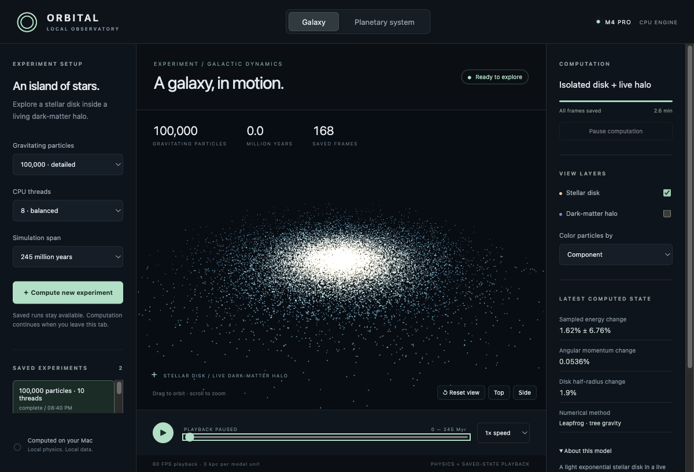
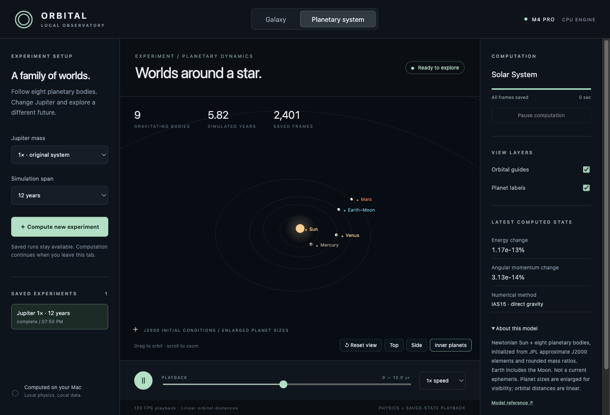

# Orbital — local CPU observatory

Open **http://127.0.0.1:8766** while the server is running (`/lab` opens straight into the composer).

## What is built

- **One page.** Library of runs on the left, the 3D stage in the centre, and a context panel on the right with three views: *Run* (status, ETA, where it computes, hand-off, health strip, diagnostics, history charts, events, log), *New* (every initial-condition slider, where to compute, split, estimate, Start / Add to queue) and *Nodes*. While composing, the stage shows an 8,000-particle sample of the initial conditions from `/api/preview` — nothing is integrated until Start. Three.js loads lazily (`viewer.js`); **Layers → 3D rendering** switches it off and releases the GPU context and frame cache. The frame cache stays byte-capped (~96 MB).
- **Galaxy (model revision 5 for new runs):** 1–5 live N-body galaxies on one leapfrog tree. Galaxy A keeps the full structure/lifecycle knobs; galaxies 2–5 are compact clones (mass, size, placement, velocity, spin). Isolated `n_galaxies=1` still bit-matches the revision-3 disk+halo (same DF; generator stamped 4). Default new Compute job is **2 galaxies**. Optional central black hole and collisionless stellar lifecycle. All particles contribute gravity. Revision 5 sets disk rotation from the thick, softened disk's measured midplane pull (revision 4 used the razor-thin Freeman curve, which over-spun compact, thick or disk-dominated disks by up to ~2× near the centre and made them hollow into expanding rings), and lifecycle mass transfer carries momentum. Saved revision-4 runs keep their own physics on resume; `galaxy()` still defaults to `revision=4` so older revisions reproduce bit for bit. 10,000–1,000,000 particles shared across the live galaxies; 1–14 CPU threads; span limited by a 120-hour compute cap. This is not a calibrated MW–M31 run and not a prescribed merger movie.
- **Planetary system:** the Sun and eight planetary bodies, using JPL approximate J2000 orbital elements, rounded mass ratios and a direct Newtonian integrator. Jupiter at 1×, 3× or 10×, per-planet mass scales 0.25–10×, and an optional perturber body.
- Rotate, zoom, top/side views, inner-planet view, color/stage/galaxy/layer controls, timeline scrubbing, playback speed, and independent computation pause/resume.
- **Star inspector.** Click (not drag) a star, gas or halo particle, or a planet on the stage. A ring marks it and a card shows its values at the playhead's saved frame: stage, speed, distance from its galaxy's centre, height off its disk, nearest galaxy, mass and position. The card also shows its saved track as a line in 3D up to the playhead, charts of distance and speed, the closest/farthest/fastest points so far, stage changes, and when it first came nearer another galaxy than its own. The track grows as the worker saves frames. **Follow with camera** keeps it centred. Values change once per saved frame (~240 per galaxy run); the ring's motion between frames is display interpolation, not recorded physics. Each galaxy dot is a superparticle, not one star. A galaxy's centre is its central black hole when it has one, otherwise a shrinking-sphere density centre of 1,024 sampled disk particles; the disk plane is a fit to the same sample and is reported as undefined once the disk stops being flat. Both are estimates computed from saved frames and lose meaning after a merger. Speed is in the simulation's centre-of-mass frame. In the composer's preview you can click a particle to see its initial values, but there is no track. `GET /api/jobs/:id/track?index=i&start=k` returns frames k… of body i (galaxy centres cached in server memory; frames after the committed checkpoint are recomputed).
- Locally saved frames and recoverable checkpoints (including lifecycle arrays). A LaunchAgent can keep the HTTP server alive overnight; `caffeinate` wraps the worker while it integrates. Closing the lid still sleeps a typical MacBook. The HTTP listener binds only to 127.0.0.1. Runs placed on a compute node travel to that node over SSH (see below); nothing else leaves the Mac.




## Start again

From any directory:

```sh
start-openorbital
```

That is a two-line wrapper around `outputs/observatory/start.sh`. Equivalents: `Start OpenOrbital` in zsh, or double-click `Start Open Orbital.command`. If http://127.0.0.1:8766/api/jobs already answers, it only opens the Compute dashboard and the terminal may close. If not, it writes and loads the LaunchAgent `com.openorbital.observatory` (KeepAlive for the HTTP server only), waits until ready, opens `/lab`, and exits. The agent runs a trampoline in `~/Library/Application Support/Open Orbital` so macOS will not block launchd from a Desktop/Documents/Downloads checkout. If the agent still does not answer, `start.sh` unloads it and starts `run.sh` from the current session. `stop-openorbital` unloads the agent and SIGTERMs a leftover :8766 observatory listener; workers checkpoint.

Foreground fallback (no `launchctl`): `sh outputs/observatory/start.sh` prints that the window must stay open and `exec`s `run.sh`. To start the Python listener only:

```sh
sh outputs/observatory/run.sh
```

Install or stop the daemon without opening a browser:

```sh
sh outputs/observatory/install-daemon.sh      # write plist and load
sh outputs/observatory/install-daemon.sh --write-only
sh outputs/observatory/stop-daemon.sh
```

Do not bootstrap the LaunchAgent against port 8766 while a science job is already integrating under a different server process.

This uses the isolated Python runtime at `work/venv` and the previously built multicore REBOUND library at `work/openmp`. The app has no npm server or external CDN dependency; Three.js is bundled locally with its license. Workers are wrapped in `caffeinate -dims` while they integrate; idle sleep may return when no worker is alive. Closing the lid still sleeps a typical MacBook. Interrupted jobs with `control.json` still set to `run` auto-resume on server start (not paused, not `wall_capped`). A paused job stays paused.

Saved experiments live under `work/observatory-data`, separate from the source. That path is a symlink to `work/observatory-data.nosync`, because this project sits on an iCloud-synced Desktop and the `.nosync` suffix keeps multi-GB frames and checkpoints out of iCloud. Workers run at macOS `utility` QoS so the server and browser stay responsive; set `OBSERVATORY_WORKER_QOS=user_initiated` in the server's environment for maximum step speed. Set `OBSERVATORY_DATA` to an absolute directory before launching to choose another location. Each run contains its configuration (including free-text notes), metadata, binary frames, optional `diagnostics.jsonl` and `galaxy_index.bin`, checkpoint pairs, status, and log. New runs also archive `physics.py` and `stellar.py`. The application retains up to twenty-four runs and checks for free disk space. A 25th Start is rejected until one run is removed (Compute disables Start at 24/24). Runs are removed only through the Compute page's confirmed **Remove** (or `DELETE /api/jobs/:id`); the four original comparison ids (`0e45a855ba11`, `44c528079f88`, `ff56d195ce89`, `58ab7c268cdd`) stay protected if those folders exist.

## Arrange experiments in a queue

On **Compute**, configure an experiment and click **Add to queue**. Repeat for each galaxy or planetary experiment, use **Move up / Move down** to arrange waiting runs, then click **Start queue**. The server runs them one at a time, even after the browser tab closes. A LaunchAgent can keep the HTTP server alive; closing the lid still sleeps the Mac.

**Hold queue** lets the current run finish but prevents the next from starting. **Stop computation** pauses the selected run; pausing the queue's current run blocks the batch until resumed or removed. Older unrelated paused experiments do not block a new batch. If a manual experiment is already computing when the queue starts, the queue waits for it and treats it as its current run. Failed workers hold the queue; review the failure, then Start queue to continue past it. After a daemon restart, queue `enabled` is preserved; an interrupted current job with `control=run` auto-resumes. Paused jobs stay paused.

Waiting runs can be removed using the existing confirmation dialog. Queued and completed experiments together count toward the 24-run limit. Disk checks include all waiting jobs and are repeated before launch. Adding to an enabled queue appends work to the active batch. Settings are saved when added; changing sliders afterwards does not edit a waiting run.

Agent map: server.py owns the scheduler, under the same lock as API mutations. `work/observatory-data/queue.json` atomically stores `enabled`, ordered `ids`, `current`, and a status message. A queued job has config/status but no worker or frames yet. `/api/queue` GET reads state; POST accepts `start`, `hold`, `up`, `down` (moves include `id`). `/api/queue/jobs` POST validates and adds a new experiment. Only one server may own a data directory. Physics and frame formats are unchanged.

Validation: `PYTHONPATH="$PWD/work/openmp" work/venv/bin/python outputs/observatory/tests/validate_queue.py` runs real small workers with temporary data on port 8767. Existing API tests can save a separate report using `OBSERVATORY_TEST_REPORT` to preserve historical evidence.

## Compute nodes: this Mac, computenode1, an always-on cloud VM

Every experiment has a placement, chosen under **New → Where to compute**:

- **This Mac** — as before.
- **A node** — the whole run computes there. The Mac pushes its exact `physics.py`, `stellar.py` and `worker.py` (content-hashed under `<root>/work/remote-runs/engine/`) plus the run's config, starts `worker.py` with `nohup`, and pulls `status.json`, diagnostics and **new frames** back every ~3 s. Frames land on the Mac before its `status.json` advertises them, so the stage plays a remote run exactly like a local one. The node keeps computing while the Mac sleeps; the Mac catches up when it wakes.
- **Split across machines** — a chain of up to five legs, each running until a chosen fraction of the span (for example This Mac to 30% → computenode1 to 60% → another node to the end). If the next machine is busy, the run keeps computing and hands off when it frees up. Any running or paused run can also be handed off manually from **Run → Hand off to**.
- **If this Mac sleeps or closes** (runs that start on the Mac; default: the fastest ready always-on node). While the run computes, the Mac copies its latest checkpoint pair to that node (2 s per MB, 2–30 min apart; ~5 min at 1M particles, whose pair is 138 MB) and touches a heartbeat file there every 10 s. A stdlib watchdog on the node (`<runs>/standby_watchdog.py`, started and restarted by the Mac over SSH, exits after 10 idle minutes) resumes the copy if the heartbeat is older than 90 s. Work after the copy is recomputed there. When the Mac is back, its server stops the Mac's own worker, discards Mac frames after the copy, follows the node, and — if **Hand back to this Mac when it wakes** is on — hands the run back once the node's worker is seen running. Paused runs are disarmed, so they are never picked up. Grace, heartbeat and minimum copy interval can be overridden with `OBSERVATORY_STANDBY_GRACE`, `OBSERVATORY_HEARTBEAT_SECONDS` and `OBSERVATORY_STANDBY_MIN_INTERVAL` (tests only).
- **Twin run (reproducibility check)** — the identical experiment computed on two machines at the same time. **Run → Twin** charts the median and 90th-percentile separation of the same particles in the two runs (a strided sample of up to ~20,000) and compares disk half-radius, energy change, closest approach and births. On the same CPU type and thread count twins are bit-identical; across CPU types they drift apart through floating-point rounding amplified by chaos (measured Mac↔computenode1 after ~100 frames at 10k: ≈28–46 pc). Results that differ between twins by more than that drift are not robust. A hand-off pauses at the next leapfrog check, writes a checkpoint, moves only the checkpoint pair and small files (never earlier frames), and resumes on the target. It is serial, not parallel: a single simulation is never split across machines at once, because every step would wait on the network.

One experiment may compute per node at a time, so the Mac and each node can run different experiments concurrently. The timeline strip under the scrubber colours each stretch of frames by the node that computed it.

**Access is key-only.** The server runs `ssh -o BatchMode=yes`; it never stores, sends or prompts for a password. Install this Mac's key once per node (`ssh-copy-id -i ~/.ssh/id_ed25519.pub user@node`). Tailscale MagicDNS names work as hosts.

**Registry.** `work/nodes.json` (gitignored; override with `OBSERVATORY_NODES`). Edit through **Nodes → Add a node**, or `POST /api/nodes`. Each node has `host`, `root` (`~/…` or absolute), `python` and `pythonpath` (relative to root or absolute; the native OpenMP REBOUND build) and an optional `speed` factor. **Probe** checks reachability, cores, RAM, disk and that numpy, scipy and REBOUND import. **Benchmark** times 3 steps of 100,000 particles × 2 galaxies on all node cores and stores `speed` = measured ÷ this Mac's estimator for the same workload. Node estimates are the Mac estimator × that one measured factor — a prediction.

**New node (e.g. an Oracle Cloud Always Free Ampere A1).** Create the Ubuntu VM with this Mac's public key, then on the VM run `sh bootstrap.sh` from `node/` (optionally `TS_AUTHKEY=… TS_HOSTNAME=oracle-a1`). It installs Python, numpy and scipy, builds REBOUND 5.1.1 with OpenMP and joins the tailnet. Add it under Nodes, Probe, Benchmark. Oracle may reclaim an Always Free instance that stays nearly idle for seven days.

API additions for the above: `POST /api/jobs` accepts `legs: [{node, until}, …, {node}]` (older `split: {at, to}` still works), `standby: "auto" | node | "off"`, `return_on_wake`, and `twin: node`; `POST /api/jobs/:id/standby {node, return_on_wake}`; `GET /api/jobs/:id/twin` (cached in `twin_compare.json`).

API: `GET /api/nodes`; `POST /api/nodes` (add/update); `DELETE /api/nodes/:id` (refused while runs live there); `POST /api/nodes/:id/probe`; `POST /api/nodes/:id/benchmark`; `POST /api/jobs` accepts `node` and `split: {at, to}`; `POST /api/jobs/:id/move {node}`. Each run folder gains `location.json` (current node, plan, per-node history of frame ranges, hand-off state). Remote control, resume and Remove act on the node too.

Validation: `work/venv/bin/python outputs/observatory/tests/validate_nodes.py` runs a real server on port 8767 with a fake `ssh` that executes the "remote" shell locally under a temporary `$HOME`. It checks probe, a remote planetary run mirrored byte-for-byte, per-node concurrency, planned splits in both directions, a manual hand-off mid-run, that every split run's `frames.bin` is **byte-identical** to an unsplit 1-thread reference, a three-machine chain, twins (divergence exactly 0 on one CPU), and a standby pick-up: the test freezes the Mac's server and worker with SIGSTOP (what sleep does to processes), the node resumes from its copy, and after SIGCONT the run is handed back to the Mac — all byte-identical to their references. It also checks that Remove deletes the node copy. `tests/validate_node_live.py <node>` repeats the hand-off checks against a real node.

## Real World Physics (model revision 6)

One toggle on the **Physics** tab (config `realistic: true`). It applies to new galaxy runs; saved runs keep their own physics. Off is the standard revision-5 model, unchanged bit for bit. On (`physics.py` revision-6 ICs, `realistic.py` runtime, `stellar.ssp_tables`):

- **Gas is a fluid.** Isothermal SPH at 10⁴ K (c_s = 10 km/s): cubic-spline kernel, 32 neighbours, Monaghan signal-velocity viscosity with a Balsara switch, pairwise-antisymmetric forces (momentum conserved to round-off). Applied as half kicks around each REBOUND leapfrog step. Shocks dissipate energy (the isothermal assumption means it is radiated), so gas can settle and flow inward, which a collisionless model cannot do.
- **Star formation** from gas above 0.1 H/cm³ at ε_ff = 1% per free-fall time (Krumholz, Dekel & McKee 2012; threshold as Schaye & Dalla Vecchia 2008). Stochastic, whole-particle conversion.
- **Star particles are stellar populations.** Mass return and core-collapse supernova counts per M☉ formed come from the same Kroupa IMF, lifetime law and remnant masses as the single-star lifecycle (`ssp_tables`: 42% returned by 10 Gyr, 0.0109 SN per M☉, all by ~55 Myr). Returned mass goes to the 32 nearest gas particles within 1 kpc and carries the population's momentum.
- **Supernova feedback:** 2.8×10⁵ M☉ km/s per supernova × (n_H)^-0.17 (Kim & Ostriker 2015), radial to the same neighbours, with the net vector removed so total momentum is unchanged.
- **Equilibrium halos:** Hernquist profile (a = 0.54 × the Plummer slider, same half-mass radius), truncated at 300 kpc, speeds from Eddington's inversion in the galaxy's total spherical potential. The disk's radial dispersion cap becomes 0.6 v_c (revision 5: fixed 0.35); the gas disk is cold (c_s) and pressure-corrected.
- **Numerics from criteria, not sliders.** Softening = the mean particle spacing in the densest disk's midplane at R = Rd (shrinks as N grows). The step is global and adaptive: every step obeys dt ≤ √(2ηε/|a|) (η = 0.025, GADGET-2) for every particle and the SPH Courant condition (0.3), capped at 0.02, and lands exactly on 241 evenly spaced frames. θ remains the slider.
- Locked sliders on New: dt, softening, lifecycle on/off, t_sf, lifecycle speed, birth density bias, protostar accretion, remnant kick.

Why softening follows N (measured 2026-09-29, galaxy B of run `f559cd291229` alone, 22,500 particles, revision 5): disk c/a after 1 Gyr was 0.30 / 0.28 / 0.24 / 0.23 / ~0.18 at softening 54 / 120 / 180 / 270 / 390 pc. Smaller softening at low N makes particles scatter harder. At 90,000 particles c/a grew about 4× more slowly in σ² terms. The Physics tab shows a particle-noise heating time per galaxy (Binney & Tremaine eq. 7.106 estimate). **Particle count is the accuracy lever for long runs; Real World Physics does not remove two-body noise.**

Not included: cooling below 10⁴ K / multiphase ISM, magnetic fields, cosmic rays, black-hole accretion and AGN feedback, metals, cosmological infall, relativity. `POST /api/realistic` returns the numbers the tab shows. Validation: `tests/validate_realistic.py` → `validation_r6.json`.

## Stellar lifecycle — what it is and is not

Types stored per particle: gas, protostar, main sequence, giant, white dwarf, neutron star, black hole, halo, central black hole. Birth converts the densest gas parcels at rate gas mass / `t_sf`; each new star draws a Kroupa mass that sets its clock, while the parcel's gravitational mass is unchanged. Lifetime is `10 Gyr × (m/M☉)^-2.5` clipped to 3–20,000 Myr. At death the parcel keeps only the remnant fraction of its mass; the rest returns to neighbouring gas, so total mass is conserved (measured drift 0.0 at speed 40). `lifecycle_speed` multiplies the clock: 1 = physical lifetimes (only massive stars die within 245 Myr); ~40 fits a solar lifetime into a 250 Myr run. Any speed other than 1 is a laboratory setting, not a calibration. There is no hydrodynamics, cooling, feedback energy, binaries or chemistry, and energy change is not a numerical-error bound when the lifecycle is on.

## Completed test instance

| Run | Result |
|---|---|
| Galaxy, revision 2 | 100,000 particles: 30,000 stellar + 70,000 halo |
| Duration | 245 Myr; 500 integration steps; 168 saved frames |
| Active computation time | 157.84 seconds on 10 threads, including snapshot and diagnostic work |
| Disk half-radius change | +1.93% |
| Total angular-momentum change | 0.0536% |
| Solar System | 12 years; 2,401 frames; relative energy change 1.17e-15 |
| Modified Solar System | Jupiter at 3× mass; 12 years; completed through the browser UI |

The original revision-1 galaxy run remains available for comparison. It used a colder, less balanced disk and contracted by about 12%; the revision-2 model uses disk circular forces and approximate Jeans velocity support. Neither is a calibrated model of the Milky Way.

## Validation and limits

- `validation.json`: analytical two-body period check, 50-year planetary energy check, small-galaxy timestep/tree comparisons, and checkpoint continuation agreement.
- The 2,048-particle galaxy test had relative energy change 4.40e-5 over ten model time units; halving the timestep reduced it to 5.69e-6. These small-model results do not establish the same error at 100,000 particles.
- `api_validation.json`: real server restart and resumed integration; the first saved frame stayed identical, paused frames stopped growing, concurrent active jobs were rejected, and invalid frame requests were rejected.
- Browser checks covered both modes, a new modified planet run, pause/resume, timeline seeking, layers, camera controls and responsive layouts. No browser console errors were observed during these checks.
- Large-galaxy energy is a **Monte Carlo estimate**, with approximate sampling uncertainty displayed. It is not an integration-error bound. The measured 1.62% difference has approximately 6.76% sampling uncertainty.
- Galaxy units are G=1, mass=10^10 solar masses, length=3 kpc and time=24.50 Myr. The tree opening angle is 0.4, softening is 0.06 model lengths and timestep is 0.02 model time units. This is an exploratory collisionless model, with no hydro ram-pressure, relativity or resolved binary-star encounters. Long-term equilibrium is not established by the short test. Birth-galaxy colors are frozen at t=0.
- Planet sizes are enlarged for visibility; orbital distances are linear. Orbital guides show the initial Keplerian elements. Playback interpolates saved positions; it does not replace the CPU physics.
- Benchmark timings for a uniform sphere do not directly predict this centrally concentrated disk/halo workload.
- **Revision 3 evidence** (`validation_r3.json`, `api_validation_r3.json`): revision-2 initial conditions reproduced exactly by the new defaults; lifecycle-off 2,048-particle bounds unchanged; lifecycle-on mass conservation to float precision with deterministic resume; a full-knob API run with 24-byte frames, server restart and checkpoint recovery. Historical files were not modified for later revisions.
- **Revision 5 evidence** (`validation_r5.json`, `api_validation_r5.json`): all revision-4 metrics reproduce exactly (revision-3 bit-match 0.0); the new disk curve matches direct summation within 0.4% and the Freeman curve in the thin limit; the 7ffea0bd7149 galaxy settings grow their disk half-mass radius 40% by t=3 instead of 150% (still Toomre-unstable at warmth 0.4); default galaxy energy 3.8e-5 over t=10; lifecycle momentum change 2e-18 (revision 4: 3e-5); an edge-crossing particle no longer leaves a step computed on a partial tree.
- **Revision 4 evidence** (`validation_r4.json`, `api_validation_r4.json`): isolated `n_galaxies=1` bit-matches the revision-3 generator; two-galaxy head-on separation decreases; five-galaxy N split; retrograde spin flips L_z; encounter lifecycle keeps halo types fixed; API accepts 2 and 5 galaxies, rejects 6, recovers a 2-galaxy checkpoint with 24-byte frames. The 120-hour estimate scales from the single measured revision-2 point, ×1.05 when `n_galaxies>1` (prediction). A 1,000,000-particle isolated galaxy (lifecycle off, 8 threads) was measured at **5.67 s/step** over 20 leapfrog steps (`validation_1m.json`); that is a short live-tree run, not a 120 h proof.

## Source map

- `physics.py`: parameterized initial conditions, unit conventions, diagnostics.
- `stellar.py`: stellar lifecycle on live REBOUND masses; baryon checkpoints.
- `worker.py`: integration, lifecycle substeps, versioned frames, controls, transactional checkpoints, 120 h cap.
- `server.py`: job management, validation schema, estimator, Remove rules and loopback HTTP API.
- `nodes.py`: compute-node registry, SSH transport, remote launch, frame sync and checkpoint hand-off.
- `node/bootstrap.sh`: turns a fresh Ubuntu VM (x86 or ARM) into a node.
- `static/index.html`, `static/app.js`: the single page (library, stage, Run / New / Nodes). Never imports three.
- `static/viewer.js`: Three.js scene, frame cache, interpolation, preview. Loaded lazily.
- `static/shared.js`: slider schema, estimator (incl. per-node), formatters.
- `static/style.css`: layout for desktop, narrow and phone widths.
- `tests/validate_physics.py`, `tests/validate_api.py`, `tests/validate_queue.py`, `tests/validate_nodes.py`: numerical, recovery, queue and compute-node checks (write `*_r4.json` / `queue_validation.json`; never overwrite historical `validation.json` / `validation_r3.json`).

Run validation from the task root:

```sh
PYTHONPATH="$PWD/work/openmp" work/venv/bin/python outputs/observatory/tests/validate_physics.py
PYTHONPATH="$PWD/work/openmp" work/venv/bin/python outputs/observatory/tests/validate_api.py
```

The API test creates an isolated temporary run and uses port 8767.

## Model references

- [JPL approximate planetary elements](https://ssd.jpl.nasa.gov/planets/approx_pos.html)
- [JPL planetary physical parameters](https://ssd.jpl.nasa.gov/planets/phys_par.html)
- [REBOUND Plummer model example](https://rebound.hanno-rein.de/c_examples/selfgravity_plummer/)
- [Exponential disk gravity](https://galaxiesbook.org/chapters/II-01.-Gravitation-in-Galactic-Disks_3-Gravitational-potentials-from-disk-density-distributions.html)
